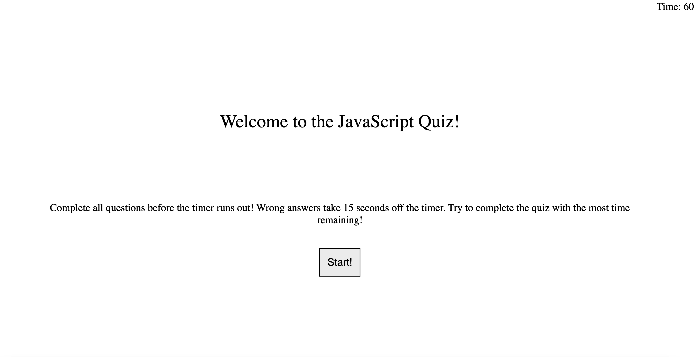

# JavaScript Quiz

## Description

Provide a short description explaining the what, why, and how of your project. Use the following questions as a guide:

In order to test my classmates on the JavaScript that we've learned so far, we will need a quiz! This quiz tests users of 5 important concepts needed to build JavaScript websites. Don't go too fast though, wrong answers will deduct 15 second from your time! Answer all questions in 60 seconds to win!

While making this project I learned the importance of separating logic in different js files in order to keep them readable. 

## Usage

To access the project, follow this link! https://nolacoder.github.io/04-Module-Challenge/

This quiz features 5 questions. Every time you answer one, you are brought to the next question. 

When you complete all 5 questions before the timer runs out you will win and see the Win screen. Here you can enter your initials which are stored in local storage.

If you fail to answer all questions before the timer runs out you will be taken to the Lose screen. Here you can click the button and try again!

Every incorrect answer deducts 15 seconds from the time.

